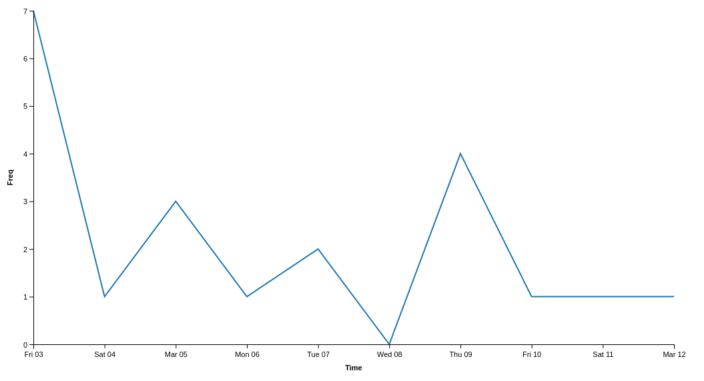
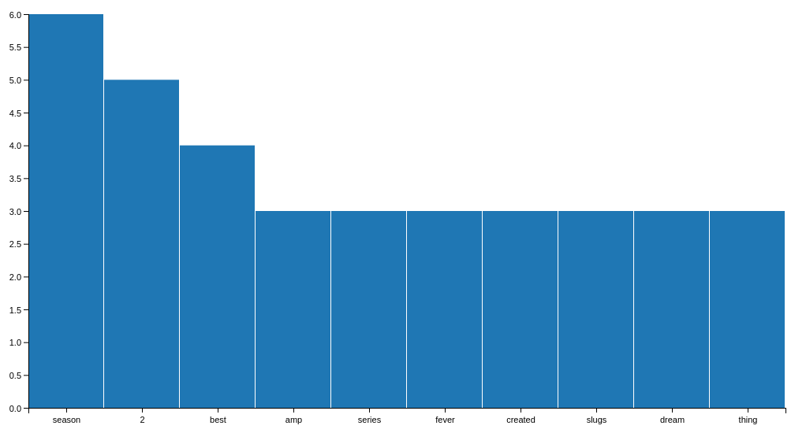
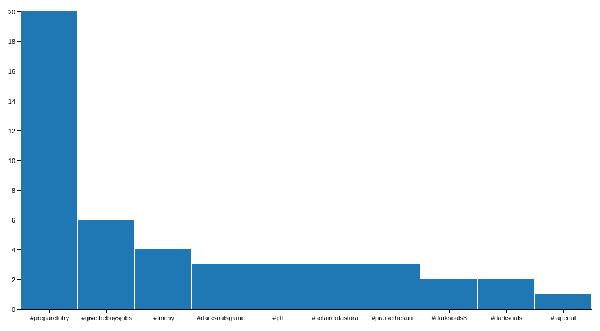
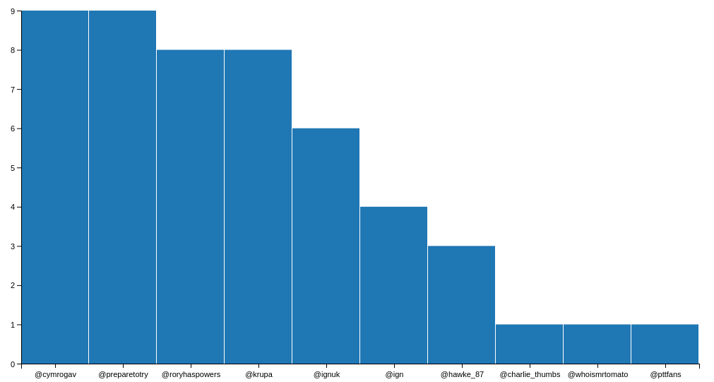
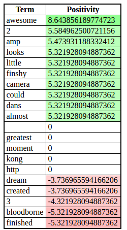

# #PrepareToTry Tweet Analysis

## Background

We previously saw in the @PrepareToTry analysis that the top Hashtag was #PrepareToTry, so lets have a look at that. When
searching for hashtags we are limited to receiving tweets from only the last 7 days due to Twitter's API, so that does give
us a smaller scope of results to analyse.

## Tweet Analysis

### Usage

From the command line:
```bash
$ python src/main.py
Would you like to analyse a user timeline(1) or search a hashtag(2): 2
Please enter the hashtag to search with: #PrepareToTry
Report ready to view at http://localhost:8000/report/tweet-analysis.html
Report will be available for the next 10 minutes
```

We choose to search for the #PrepareToTry hashtag (note we could include or exclude the hash symbol # - both are valid) and
our results are made available at http://localhost:8000/report/tweet-analysis.html.

### Results

While previously when looking at @PrepareToTry, we were analysing what the @PrepareToTry user is saying; we are now analysing
what is being said about #PrepareToTry.

#### Tweet Timeline

Analysing the timeline of the hashtag #PrepareToTry allows us to analyse the recent popularity trend of the show.



#### Top Terms



Here we see that some of the most commonly appearing terms are less predictable than when we looked at @PrepareToTry:
 * "season", "2" - ok so this one is a little obvious
 * "episode", "new" - common for a TV shown
 * "slugs" - we know this one, it's the name given to the fans of Prepare To Try
 * "praise", "sun" - again, we now know this is from the "Praise the Sun" catch phrase
 * "amp", "thing", "best" - all of these are ones we would have failed to guess

#### Top Pair's of Terms

Looking at the pair's of terms we now get to see some interesting pairs, and even some emoji's being captured.


* "2,season" - Season 2, given that this is the season they have just concluded this makes sense to be highly rated
* "telly,:smiley:"

#### Top Hashtags



#### Top Usertags



#### Top Positive/Negative Terms


