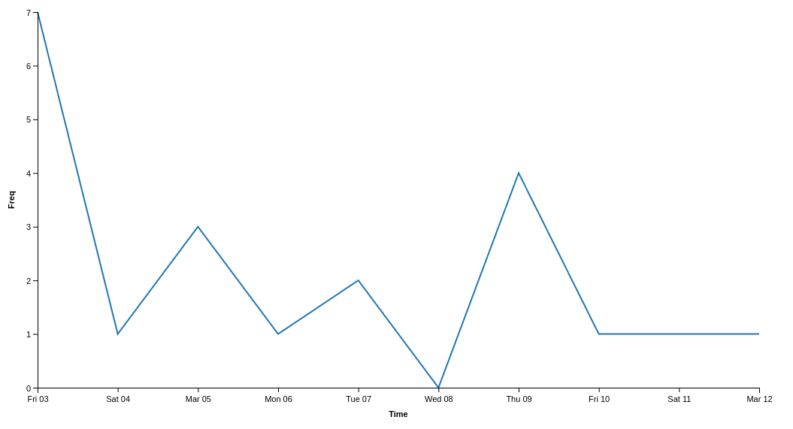
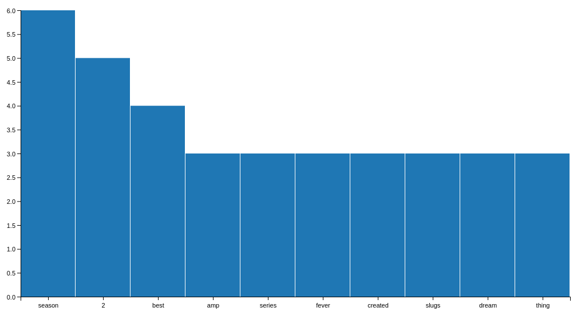
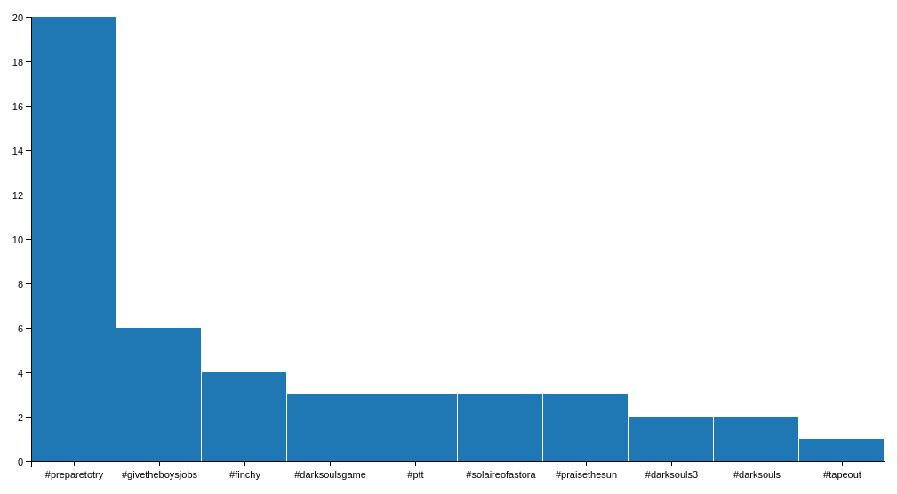
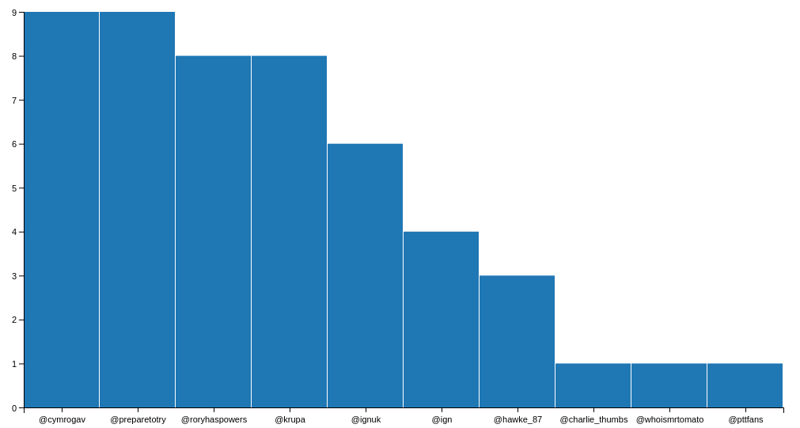
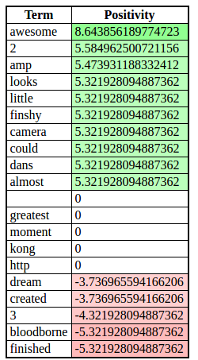

# #PrepareToTry Tweet Analysis

## Background

We previously saw in the @PrepareToTry analysis that the top Hashtag was #PrepareToTry, so lets have a look at that. When
searching for hashtags we are limited to receiving tweets from only the last 7 days due to Twitter's API, so that does give
us a smaller scope of results to analyse.

## Tweet Analysis

### Usage

From tweet-analyser/src via command line:
```bash
$ python main.py
Would you like to analyse a user timeline(1) or search a hashtag(2): 2
Please enter the hashtag to search with: #PrepareToTry
Report ready to view at http://localhost:8000/report/tweet-analysis.html
Report will be available for the next 10 minutes
```

We choose to search for the #PrepareToTry hashtag (note we could include or exclude the hash symbol # - both are valid) and
our results are made available at http://localhost:8000/report/tweet-analysis.html.

### Results

While previously when looking at @PrepareToTry, we were analysing what the @PrepareToTry user is saying; we are now analysing
what is being said about #PrepareToTry.

#### Tweet Timeline

Analysing the timeline of the hashtag #PrepareToTry allows us to analyse the recent popularity trend of the show.



We see that most activity of tweets using #PrepareToTry was on Friday 3rd March, when they last posted context.
Since then the amount of people tweeting with the hashtag has dropped considerably due to the interest dropping
without more content being released.

#### Top Terms



Here we see that some of the most commonly appearing terms are less predictable than when we looked at @PrepareToTry:
 * "season", "2" - ok so this one is a little obvious
 * "series" - common for a TV shown
 * "slugs" - we know this one, it's the name given to the fans of Prepare To Try
 * "amp", "thing", "best", "fever" - all of these are ones we would have failed to guess

#### Top Pair's of Terms

Looking at the pair's of terms we now get to see some interesting pairs, and even some emoji's being captured.


* "2,season" - Season 2, given that this is the season they have just concluded this makes sense to be highly rated
* "telly,:smiley:"

#### Top Hashtags



Given that we are searching by the #PrepareToTry hashtag, it's unsurprising that it is also the top hashtag
- it will be in every tweet result.  However looking at the rest:
* "#givetheboysjobs" - this is in reference to a tag they tried to get viral after completing Dark Sousl 3.  Given
that we see it as the second highest hashtag we can assume it did get some traction
* "#finchy" - the name of the main character
* "#darksoulsgame", "#darksouls", "#darksouls3" - all references to the Dark Souls games
* "#ptt" - given that twitter limits tweets to 120 characters it's not surprising when we see shortend versions of
other hashtags, in this case the #PrepareToTry hashtag
* "#solaireofastoria", "#praisethesun" - a little more obscure but again these are references to the franchise

#### Top Usertags

Here we see largely the same trend of users as we saw when analysing @PrepareToTry:



* "@cymrogav", "@preparetotry", "@roryhaspowers", "@krupa" - handles used by the hosts
* "@ignuk", "@ign" - handles used by IGN - the company publishing the content

#### Top Positive/Negative Terms

Finally we look at the positivity of some of the words being used in these tweets.



We can see that there is a lot of positivity in regards to the hosts and the show, for example "dans" will be a
reference to Daniel Krupa, one of the hosts; while we see negativity mainly around the end of the show, for example
"finished".