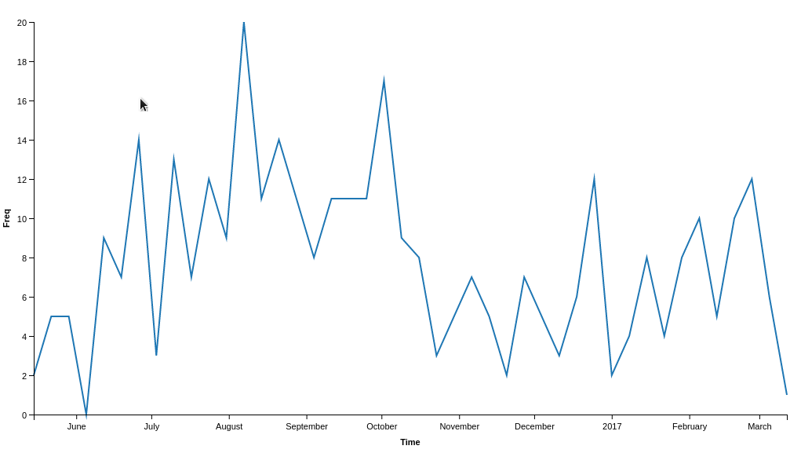
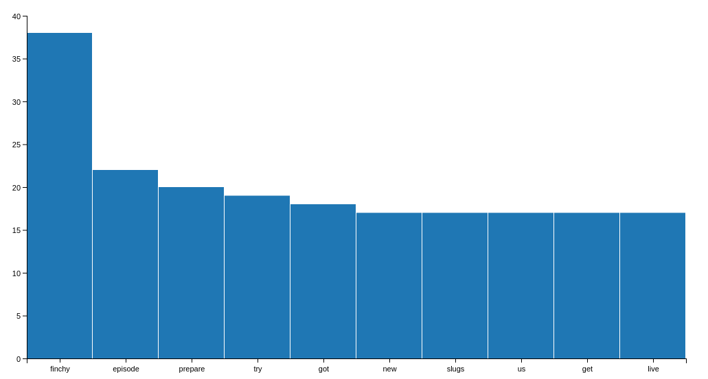
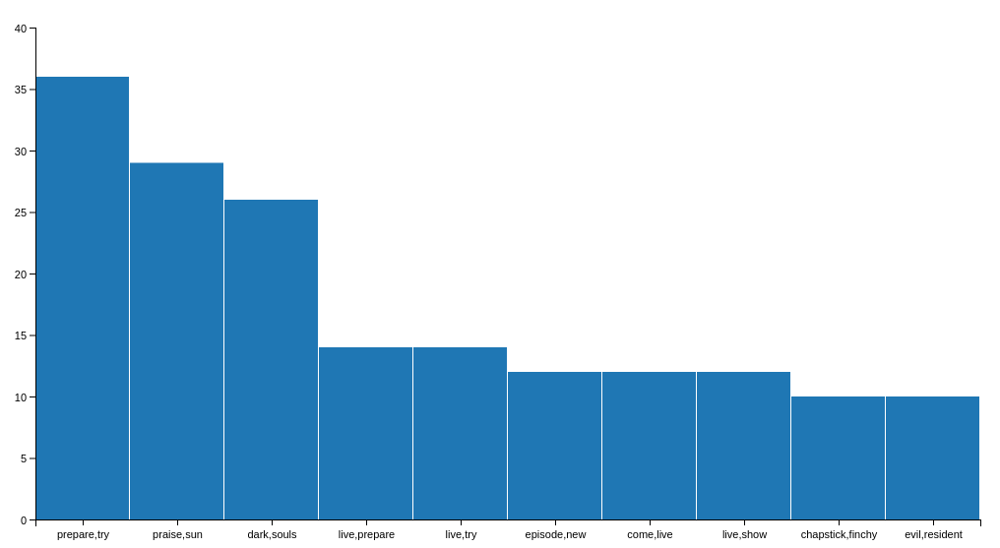

# @PrepareToTry Tweet Analysis

## Background

As an avid gamer I spend a lot of my time reading gaming articles. One of the biggest gaming websites is IGN and last
year I found myself slightly addicted to their Dark Souls Let's Play comedy series [<b>Prepare To Try</b>](http://uk.ign.com/watch/prepare-to-try)
where <i>"3 idiot friends try to beat Dark Souls while slowly losing their minds"</i>.

Around the same time I started to become interested in Natural Language Processing with Twitter and thought Prepare To
Try would make an ideal candidate for some example tweet analysis.  With tweet-analyser complete(ish) we can now do this,
and while the final output may not be as pretty as I initial hoped for (screw it, I'm a Data Scientist not a JavaScript
developer) we can still get some interesting results.

## Tweet Analysis

### Usage

<b>Prepare To Try</b> uses a couple of key terms (<i>#PrepareToTry, @PrepareToTry, #PTT, #Finchy</i>) so we instantly have a
few choices about what we want to investigate. However if we weren't familiar with the source material it wouldn't be
unusual to start with the user timeline to see whats the user is saying, in this case we'll search for the offical usertag
<i>@PrepareToTry</i>.

From the command line:
```bash
$ python src/main.py
Would you like to analyse a user timeline(1) or search a hashtag(2): 1
Please enter the twitter screen_name: PrepareToTry
Report ready to view at http://localhost:8000/report/tweet-analysis.html
Report will be available for the next 10 minutes
```

As above the application asks the user whether they would like to search a user's timeline, or search for a hashtag.
Since we are decided to search for the @PrepareToTry user we choose option 1, and enter PrepareToTry as the user
we want to search for. Our results are made available at http://localhost:8000/report/tweet-analysis.html using a WebServer
we spin up in the background and is available for viewing for number minutes (you can tweek this in main.py).

### Results

So now that we've processed all tweets from @PrepareToTry let's find out what those tweets are talking about.

As a note we should differentiate between searching for a hashtag such as #PrepareToTry and a user's timeline such as
@PrepareToTry.  Searching for the #PrepareToTry hashtag will return us any tweet from any user that has posted using that
hashtag, while scanning the @PrepareToTry user timeline will return that user's timeline which usually contains only that
user's tweets.  It's a subtle but significant difference between whats been said about that hashtag, and what that user
is saying.  What we're interested at here is what the @PrepareToTry user is saying, so lets head over to the
report.

#### Tweet Timeline

The first thing we can see is the recent trend of tweets from @PrepareToTry. We can see a very variable trend, though with
some pre-existing knowledge we can attribute these peaks and dips. The peak in October was due to FinchyFest - their live
show at the end of Season 2, drop between this and December was whilst they were off the air, the peak in late December was
due to their short Resident Evil season, and the peak in March was due them doing the Dark Souls Artorias of the Abyss DLC.
Since then the tweets have died off due to them not being on the air and promoting new episodes.




#### Top Terms

While looking at the timeline tells us about the overall activity of the show over time, it doesn't tell us much about the
context of what the show is saying. Instead we can look at a simple aggregation of all the terms (words/urls/emoji's/etc)
to see what terms are appearing most frequently in tweets by @PrepareToTry. To avoid this being dominated by useless
information we remove most commonly appearing words that hold little interest, such as "a", "the", "is", "that", etc.



 Here we see that some of the most commonly appearing terms are ones we could have expected such as:
  * "prepare", "try" - parts of the name
  * "episode", "new" - common for a TV shown

 However, we also see some we probably wouldn't expect without prior knowledge of the show:
 * "finchy" - the main characters name
 * "slugs" - the name given to the fans of Prepare To Try
 * "live" - occassionally they have done live shows

#### Top Pair's of Terms

 While top terms gives us some idea of the context of the tweets, it's not perfect as many words can change their meaning when
 used with others.  For example if we take "episode" the context of this changes when used in conjunction with "new" vs "old",
 or "great" vs "terrible".  Instead we can take the same view and look at the top pair's of terms.



Again we should be unsurprised to see that the top pair-term is the name of the show "prepare,try" and also ranked high is
"episode,new" - so we can tell that they frequently tweet about new episodes being out; however we are already starting to see
some much more interesting results:
* "dark,souls" - although this is already known to us, if we were unaware we would be able to infer that this show has something
to do with the Dark Souls franchise
* "evil,resident" - while less than the "dark,souls" aggregation, this tells us that the show also has something to do with the
Resident Evil franhcise - in fact they did do a short 6/8 episode season playing the original Resident Evil game
* "praise,sun" - ok, so a slightly obscure one, but a quick google of "praise,sun" shows us that this comes from "Praise the Sun",
a well known phrase from the Dark Souls game.  Along with our "dark,souls" pair this would definitely tell us that the show is
about the Dark Souls games.
* "live,show" - again, if we didn't already know it this would confirm to us that they do live shows.

#### Top Hashtags

On top of looking at what the @PrepareToTry account is saying, we can also look at what hashtags they are using. Hashtags are
useful as they are a great way of looking at viral trends as they can be used by anyone and do not required a hashtag to aready
exist - anyone can start one.


Unsurprisingly we see that the top hashtag is "#preparetotry", however we also see "#darksouls", "#preparetotrylive",
"#praisethesun", "#finchyfest", and "#darksouls3". None of these tell us anything we haven't already discovered, however
they would re-enforce any assumptions we may had made if we didn't have any pre-existing knowledge. If we wanted to continue
this line of thought we could now look at analysing the tweets from the #PrepareToTry hashtag.

#### Top Usertags

Similar to looking at hashtags, we can also filter our results to mentions of other users. This should help tell us who else the
user is talking to, which we can uses to piece together a circle of inference and user network.


We can see that the @PrepareToTry tag is being mentioned a lot, however not the highest, that goes to "@roryhaspowers", "@cymrogav",
"@krupa". Given how much higher these are than any other, it's a fair to assume that they have something to do with the show - in
fact they are the hosts of the show.

#### Top Positive/Negative Terms

So we've now been able discover how frequently the user has been tweeting, what the user has been tweeting, the context of what they
 have been tweeting, and who they having talking to; however what we haven't looked at is how they have been saying it. What we mean
 by this is trying to understand how positive or negative they are about certain terms - understanding the undertones to their tweets.
 We do this by summing the probability of a term appearing with known positive and negative words.


Although not perfect, we see a number of interesting results here. We see a lot of positivity being used in tweets containing:
* "christmas", "gift" - not surprising, who doesn't love gifts
* "finchy" - the guys love Finchy
* "lore" - lore is a big part of Dark Souls and forms the rick backstory to the games
* "couldn't" - ok so this one got me for a while, until I worked out this was most likely due to being used in positive sentences like
"couldn't believe ..." or "couldn't have done it without ..."

In terms of negativity we can really infer some more interesting results:
* "footage", "editing" - clearly the guys are not fans of editing their footage
* "defeated", "balls" - both can be considered pretty negative terms in themselves so not too surprising to see them rated low
* "boss" - probably my favourite result as anyone familiar with Dark Souls will know that bosses are filled with endless hours of pain
and torture. I liked this result as "boss" itself is not a negative term but in the context of Dark Souls it definitely is, and being
ranked the lowest validates the algorithm used to analyse the data.